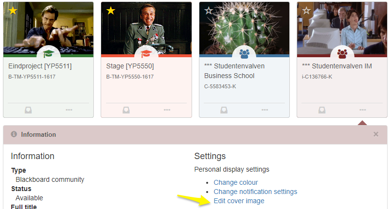

# Toledomod

No longer maintained.

For Toledo (KU Leuven)

* Change the cover images on your Toledo Tiles. Makes it easier to find a course.

## Installation

This is a userscript. You can use it by installing addons like [Tampermonkey](https://chrome.google.com/webstore/detail/tampermonkey/dhdgffkkebhmkfjojejmpbldmpobfkfo?hl=en) for Chrome or Vivaldi, or [Greasemonkey](https://addons.mozilla.org/en-US/firefox/addon/greasemonkey/) for Firefox. Then add the Toledomod.user.js script to the plugin or use the [direct link](https://github.com/Sigurd3K/ToledoMod/raw/master/Toledomod.user.js), so the addon will install it.

## Screenshot

